# 🌊 TÀI LIỆU LUỒNG HOẠT ĐỘNG TÍNH NĂNG (FEATURE WORKFLOWS)
## HỆ THỐNG QUẢN LÝ VÀ TỐI ƯU HÓA PHÂN BỔ NGUỒN LỰC (RAO STUDIO)

> **Tài liệu phục vụ Đồ án Tốt nghiệp**  
> **Sinh viên thực hiện:** Trần Xuân Trường  
> **Dự án:** Resource Allocation Optimization (RAO Studio - Web & Mobile)  
> **Mục tiêu tài liệu:** Cung cấp cái nhìn trực quan, chi tiết và có hệ thống về luồng hoạt động (Workflows), luồng dữ liệu (Data Flows), sơ đồ tuần tự (Sequence Diagrams) và logic xử lý của toàn bộ các tính năng trong hệ thống.  
> 
> 💡 *Bạn cũng có thể mở trang sơ đồ đồ họa trực quan tương tác tại:* [**`docs/architecture/DIAGRAMS.html`**](./architecture/DIAGRAMS.html) *(Mở bằng trình duyệt để xem toàn bộ sơ đồ vector có màu sắc, phóng to thu nhỏ và in/xuất sang PDF/PNG)*.

---

## 📑 MỤC LỤC

1. [Tổng quan Kiến trúc & Ma trận Phân quyền (RBAC & Architecture Overview)](#1-tổng-quan-kiến-trúc--ma-trận-phân-quyền)
2. [Module 1: Luồng Xác thực & Quản lý Phiên (Authentication & Session Flow)](#2-module-1-luồng-xác-thực--quản-lý-phiên)
3. [Module 2: Luồng Quản lý Dự án (Project Management Flow)](#3-module-2-luồng-quản-lý-dự-án)
4. [Module 3: Luồng Quản lý Công việc & Bảng Kanban (Task & Kanban Flow)](#4-module-3-luồng-quản-lý-công-việc--bảng-kanban)
5. [Module 4: Luồng Quản lý Nhân sự, Kỹ năng & Lịch trình (Resource & Skills Flow)](#5-module-4-luồng-quản-lý-nhân-sự-kỹ-năng--lịch-trình)
6. [Module 5: Động cơ Tối ưu hóa Phân bổ (GA, CSP, Hybrid Optimization Engine Flow)](#6-module-5-động-cơ-tối-ưu-hóa-phân-bổ)
7. [Module 6: Algorithm Benchmark Studio (Thực nghiệm Đánh giá Đối chứng)](#7-module-6-algorithm-benchmark-studio)
8. [Module 7: Sơ đồ Tiến độ Gantt Chart & Đường găng CPM (Critical Path Method)](#8-module-7-sơ-đồ-tiến-độ-gantt-chart--đường-găng-cpm)
9. [Module 8: Báo cáo & Phân tích Xu hướng Tải (Analytics & Workload Trend Flow)](#9-module-8-báo-cáo--phân-tích-xu-hướng-tải)
10. [Module 9: Thông báo Thời gian thực & Nhật ký Hoạt động (Realtime Sync & Audit Log)](#10-module-9-thông-báo-thời-gian-thực--nhật-ký-hoạt-động)
11. [Module 10: Trải nghiệm UX/UI, Command Palette & Ứng dụng Di động (Mobile App)](#11-module-10-trải-nghiệm-uxui-command-palette--mobile-app)

---

## 1. TỔNG QUAN KIẾN TRÚC & MA TRẬN PHÂN QUYỀN

### 1.1 Sơ đồ Luồng Dữ liệu Tổng thể (System-Wide Architecture Flow)

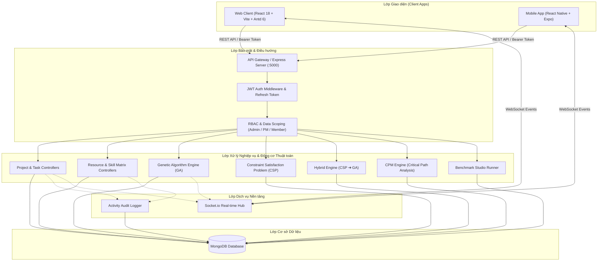

### 1.2 Ma trận Phân quyền & Cô lập Dữ liệu (RBAC & Data Scoping Matrix)

| Chức năng / Dữ liệu | Quản trị viên (`admin`) | Quản lý dự án (`project_manager`) | Thành viên (`member`) |
| :--- | :--- | :--- | :--- |
| **Xem Dashboard** | Toàn bộ hệ thống | Thuộc dự án PM quản lý / tham gia | Chỉ công việc & dự án được gán |
| **Quản lý Dự án** | Tạo, sửa, xóa tất cả dự án | Tạo mới, sửa dự án mình tạo / quản lý | Chỉ xem các dự án mình là thành viên / có task |
| **Quản lý Công việc** | Toàn quyền CRUD trên tất cả dự án | CRUD tasks trong dự án mình quản lý | Xem task trong dự án, cập nhật tiến độ task mình được gán |
| **Bảng Kanban** | Kéo thả, điều phối tất cả | Kéo thả tasks thuộc dự án quản lý | Kéo thả trạng thái công việc của mình |
| **Quản lý Nhân sự** | Toàn quyền CRUD, phòng ban, lương | Xem, tra cứu danh sách, xếp kỹ năng | **Ẩn hoàn toàn** (Không hiển thị menu & Chặn truy cập) |
| **Chạy Tối ưu (GA/CSP)** | Toàn quyền chạy & áp dụng | Chạy tối ưu cho dự án mình quản lý | Không khả dụng |
| **Benchmark Studio** | Toàn quyền thực nghiệm đối chứng | Chạy benchmark trên tập dữ liệu | Không khả dụng |
| **Sơ đồ Gantt & CPM** | Xem toàn bộ, phân tích đường găng | Xem dự án mình quản lý | Xem tiến độ dự án mình tham gia |
| **Nhật ký Hoạt động** | Xem tất cả audit logs hệ thống | Xem logs liên quan dự án mình quản lý | Chỉ xem logs của chính mình |

---

## 2. MODULE 1: LUỒNG XÁC THỰC & QUẢN LÝ PHIÊN

### 2.1 Luồng Đăng nhập & Xoay vòng Refresh Token (Login & Token Rotation Flow)

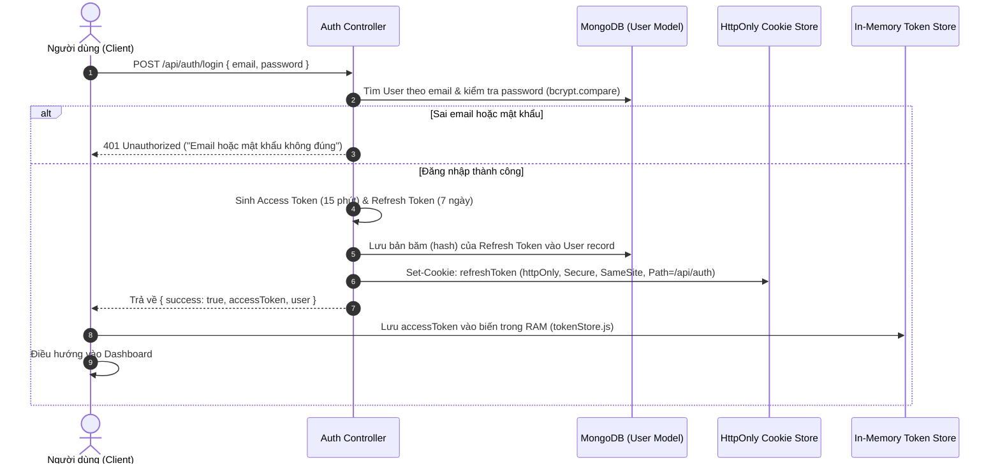

### 2.2 Luồng Tự động Làm mới Token Khi Hết hạn (Silent Token Refresh Flow)

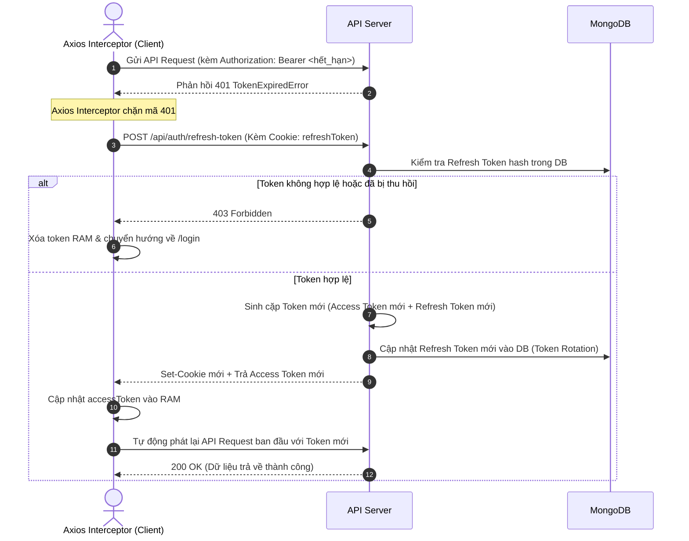

---

## 3. MODULE 2: LUỒNG QUẢN LÝ DỰ ÁN

### 3.1 Luồng Tạo mới Dự án & Tự động Tính toán Tiến độ

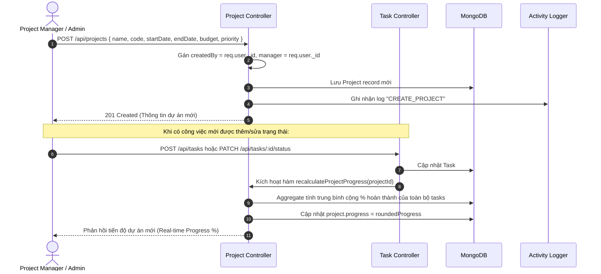

### 3.2 Luồng Phân quyền Thành viên Dự án (Project Member Allocation Flow)
- **Thêm thành viên:** PM chỉ định tài khoản nhân sự + vai trò (`lead`, `developer`, `tester`, `designer`, `devops`) + tỉ lệ phân bổ (`allocation: 10% - 100%`).
- **Tự động liên kết:** Khi bất kỳ công việc nào được gán cho một nhân sự (`Task.assignee`), hệ thống tự động kiểm tra và thêm nhân sự đó vào danh sách `project.members` nếu chưa có mặt.
- **Cô lập dữ liệu:** Thành viên chỉ được truy cập chi tiết các dự án mà mình có tên trong `members`, hoặc có công việc được gán, hoặc là người tạo/quản lý dự án.

---

## 4. MODULE 3: LUỒNG QUẢN LÝ CÔNG VIỆC & BẢNG KANBAN

### 4.1 Luồng Kiểm tra Ràng buộc Tiền nhiệm (Dependencies Validation & DAG Cycle Detection)

Khi thiết lập công việc A phụ thuộc công việc B (B phải xong thì A mới bắt đầu):
1. **Kiểm tra tự phụ thuộc:** Chặn $t_A \rightarrow t_A$.
2. **Kiểm tra cùng dự án:** Đảm bảo $t_B$ thuộc cùng dự án với $t_A$.
3. **Phát hiện chu trình vòng lặp (Cycle Detection):** Xây dựng đồ thị có hướng (Directed Graph) của toàn bộ công việc trong dự án và duyệt BFS/DFS. Nếu phát hiện đường đi ngược $t_A \rightarrow \dots \rightarrow t_B \rightarrow t_A$, hệ thống chặn lại và thông báo lỗi chu trình.

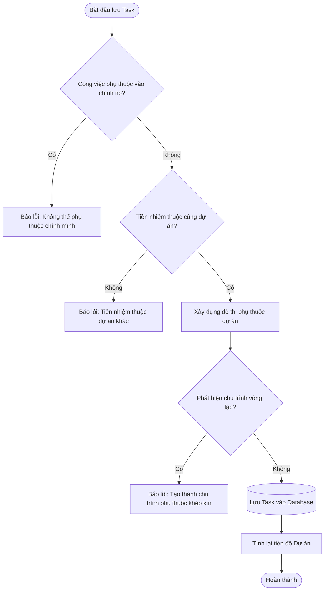

### 4.2 Luồng Kéo thả Trạng thái Kanban (Optimistic UI Drag & Drop)

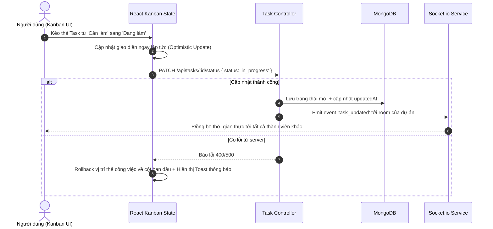

---

## 5. MODULE 4: LUỒNG QUẢN LÝ NHÂN SỰ, KỸ NĂNG & LỊCH TRÌNH

### 5.1 Luồng Thêm mới Nhân sự & Tự sinh Mã định danh
- Mã nhân sự tự động sinh tuần tự (`NV0001`, `NV0002`,...) tránh trùng lặp.
- Liên kết 1-1 với tài khoản `User` trong hệ thống hoặc tạo tài khoản mới ngay trên biểu mẫu.

### 5.2 Luồng Ma trận Kỹ năng & Lịch trình Vắng mặt (Skill Matrix & Availability Calendar)

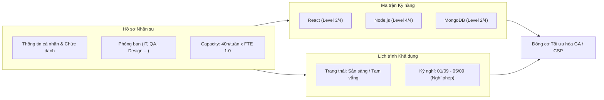

### 5.3 Cơ chế Ẩn module Nhân sự đối với Role `member`
- **Frontend Menu (Sidebar & Header):** Kiểm tra `user.role !== 'member'`, ẩn menu "Nhân sự", ẩn nút tạo nhân sự trong "+ Tạo mới".
- **Frontend Routing:** Route `/resources` được bọc bởi `<ProtectedRoute roles={['admin', 'project_manager']}>`. Nếu member gõ URL trực tiếp, màn hình hiển thị trang `403 Forbidden`.
- **Dashboard:** Lối tắt thứ 3 tự động chuyển thành **"Dự án của tôi"** thay vì "Quản lý nhân sự".

---

## 6. MODULE 5: ĐỘNG CƠ TỐI ƯU HÓA PHÂN BỔ

### 6.1 Tổng quan 3 Chế độ Tối ưu hóa

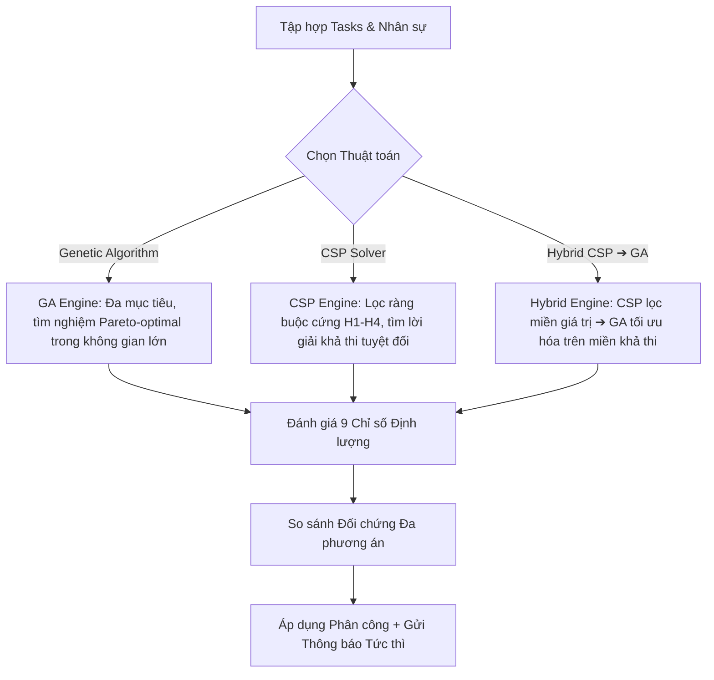

### 6.2 Chi tiết Thuật toán Di truyền (Genetic Algorithm Workflow)

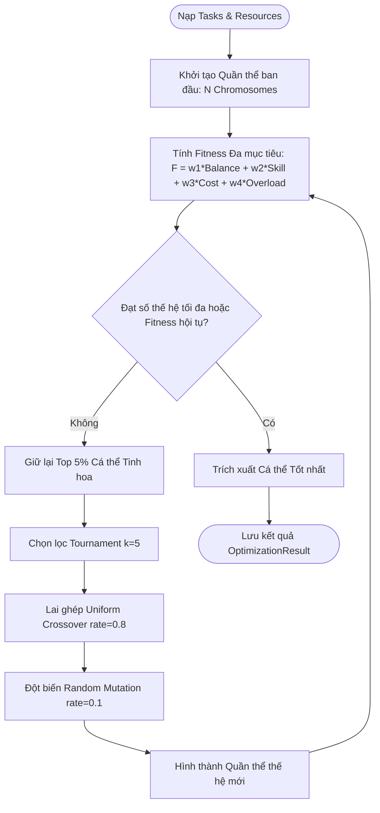

### 6.3 Chi tiết CSP Solver & Các Ràng buộc Cứng (Hard Constraints H1-H4)
- **H1 (Capacity):** Tổng giờ các task được gán không vượt quá $C_{max} \times FTE$ của nhân sự.
- **H2 (Skill Match):** Kỹ năng của nhân sự đạt yêu cầu của task (ngưỡng tương thích tổng hợp $\ge 0.5$).
- **H3 (Availability):** Nhân sự không vắng mặt / nghỉ phép trong khoảng thời gian thực hiện task.
- **H4 (Dependencies & Non-overlap):** Hai công việc phụ thuộc nhau không được chồng lấn thời gian thực hiện của cùng một nhân sự.

---

## 7. MODULE 6: ALGORITHM BENCHMARK STUDIO

### 7.1 Luồng Thực nghiệm Đối chứng Đa Thuật toán

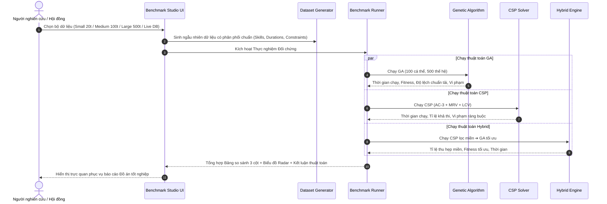

---

## 8. MODULE 7: SƠ ĐỒ TIẾN ĐỘ GANTT CHART & ĐƯỜNG GĂNG CPM

### 8.1 Luồng Tính toán Đường găng (Critical Path Method - CPM)

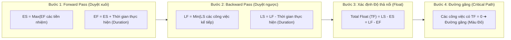

- **Ý nghĩa thực tiễn:** Giúp người quản trị dự án xác định chính xác những công việc nếu bị trễ 1 ngày sẽ làm chậm toàn bộ tiến độ dự án, từ đó ưu tiên nguồn lực tối ưu vào các mắt xích này.

---

## 9. MODULE 8: BÁO CÁO & PHÂN TÍCH XU HƯỚNG TẢI

### 9.1 Luồng Phân tích Xu hướng Tải (Workload Trend Analysis)
- Người dùng chọn khoảng thời gian (`from`, `to`) và độ chi tiết (`day` hoặc `week`).
- Hệ thống trải đều khối lượng giờ công (`estimatedHours`) của các công việc qua từng ngày trong khoảng thời gian diễn ra.
- Đối chiếu tổng nhu cầu giờ công với tổng công suất (`Total Capacity`) của đội ngũ để phát hiện các tuần thiếu hụt nhân sự hoặc quá tải (`Burnout Risk`).

---

## 10. MODULE 9: THÔNG BÁO THỜI GIAN THỰC & NHẬT KÝ HOẠT ĐỘNG

### 10.1 Luồng Bắn Thông báo Socket.io Khi Gán việc

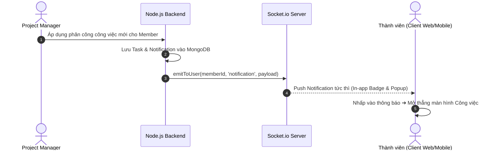

---

## 11. MODULE 10: TRẢI NGHIỆM UX/UI, COMMAND PALETTE & MOBILE APP

### 11.1 Luồng Phím tắt Tìm kiếm Nhanh (Command Palette `Ctrl + K`)
- Nhấn tổ hợp `Ctrl + K` (Windows) hoặc `⌘ + K` (Mac) để mở khung tìm kiếm toàn cục.
- Nhập từ khóa: Hệ thống tìm kiếm song song **Trang tĩnh**, **Dự án**, **Công việc** và **Nhân sự** với độ trễ < 50ms.
- Phím mũi tên $\uparrow \downarrow$ và `Enter` cho phép chuyển trang ngay lập tức mà không cần dùng chuột.

### 11.2 Ứng dụng Di động Đồng bộ (Mobile App Synchronicity)
- Xây dựng trên React Native & Expo.
- Đồng bộ toàn bộ dữ liệu dự án, công việc, bảng Kanban, hồ sơ cá nhân và cảnh báo thông báo thời gian thực qua REST API và Socket.io.
- Tự động nhận diện Role người dùng để hiển thị giao diện tối ưu (Ẩn tab Nhân sự đối với role `member`).

---

> 🎓 **Kết luận:** Hệ thống RAO Studio là một giải pháp hoàn chỉnh từ lý thuyết thuật toán (GA, CSP, CPM) đến thực thi kỹ thuật (Node.js, React 18, React Native, MongoDB, Socket.io), đáp ứng đầy đủ các tiêu chuẩn khắt khe của một Đồ án Tốt nghiệp chuyên ngành Công nghệ Thông tin.
